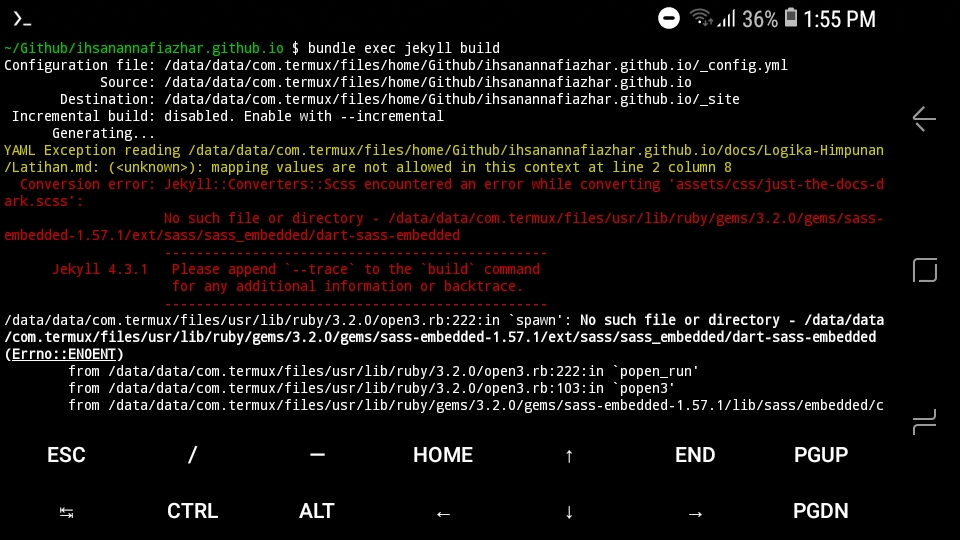

# NEVERMIND

Awalnya niatnya mau nyoba ngembangin ini web dari HP Android pake termux, eh error

Dah nyari di Google masih bingung solusinbnya, ya kek gmn, padahal klo di cek lagi filenya (baca yg merah-merah itu), filenya tu ada

Entahlah, tapi kalo _just-the-docs-default.scss_ diedit dikit, bisa sih jalan webnya, tapi kek _style_-ing nya hilang gitu.

Yaudah  deh hapus lagi tu aplikasi termuxnya. Gpp buat pengalaman

# Petualangan yang Nyata

Yea, agak lucu ya judulnya :v. Jadi memang aku sebenernya punya iPhone, blm lama sih itu HP juga. Masalahnya sebenernya lebih ke WA, soale kalo WA Android pindah ke iPhone tu chatnya kehapus semua (Kecuali iOS versi agak baru yg bisa sinkron chat WA pake Move to iOS). Akhirnya ya merelakan banyak Chat dan backup beberapa yang dirasa cukup penting.

yeee