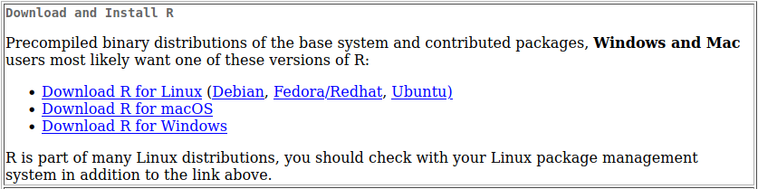

Pada mata kuliah ini, diajarkan bagaimana cara menganalisis data serta memvisualisasikan data agar dapat dipahami dengan jelas oleh pembaca.
Perangkat lunak yang digunakan adalah R, karena aplikasi tersebut gratis, tidak seperti SPSS.
R Studio disini digunakan untuk mempermudah dalam penggunaan R.

## Memasang R
+ Kunjungi Web https://cran.r-project.org/
+ Pada bagian `Download and Install R`, pilih sesuai sistem operasi yang digunakan

## Memasang R Studio
+ Kunjungi Web https://posit.co/download/rstudio-desktop/
+ Pilih sesuai sistem operasi yang digunakan
