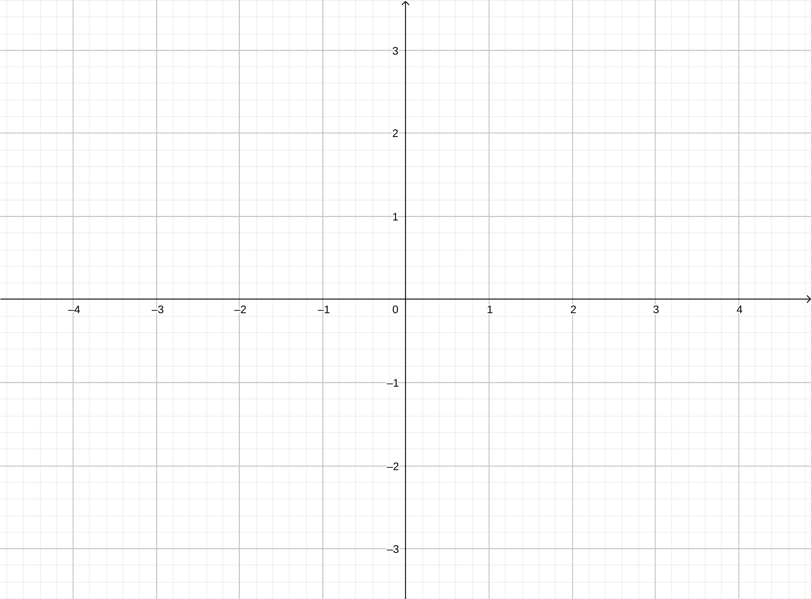

# Geometri Analitik Bidang

## Sistem Koordinat

### Sistem koordinat siku (kartesius)

### Jarak dua titik

### Koordinat titik pada ruas garis

### Sistem koordinat miring

### Sistem koordinat kutub

