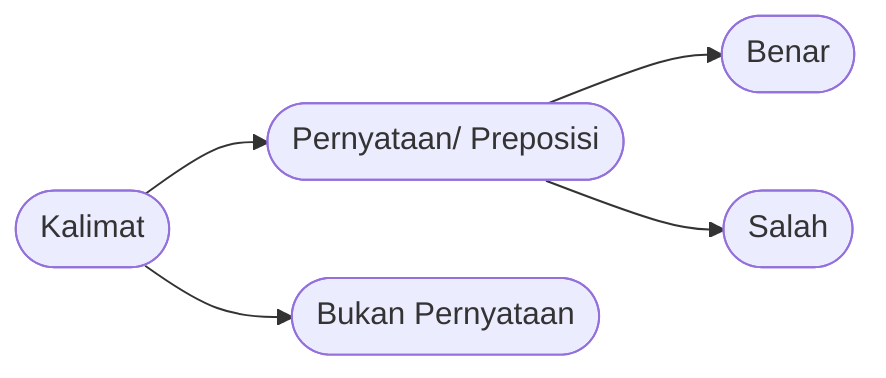
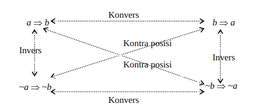

# Konjungsi dan Disjungsi

## Pernyataan
Kalimat yang **mempunyai nilai kebenaran** (benar atau salah, tetapi tidak kedua-duanya) disebut **pernyataan**

Contoh yang bukan kalimat pernyataan:
1. Apakah kamu sudah makan? (Kalimat tanya)
2. Minggir! (Kalimat perintah)
3. Semoga panjang umur (Kalimat yang berisi harapan)

Pernyataan belum tentu bermakna. Contoh:
1. Satu tambah satu sama dengan 2
2. 3 adalah bilangan genap
3. Roti adalah bilangan desimal
4. Jeruk minum jeruk

Kalimat 1 dan 2 merupakan kalimat yang memiliki makna atau bisa disebut sebagai proposisi, sedangkan kalimat 3 dan 4 tidak memiliki makna sehingga tidak bisa dinyatakan kebenarannya.

## Pernyataan Majemuk
Pernyataan majemuk dihubungkan dengan kata-kata perangkai

|   Kata Penghubung   |      Lambang      |    Nama     |
| :-----------------: | :---------------: | :---------: |
|         dan         |     $\wedge$      |  Konjungsi  |
|        atau         |      $\vee$       |  Disjungsi  |
|      jika-maka      |   $\Rightarrow$   |  Implikasi  |
| jika dan hanya jika | $\Leftrightarrow$ | Biimplikasi |

1. Negasi (kebalikan)
   Berikut tabel nilai kebenaran negasi dari pernyataan $a$
   
   |  $a$  | $\neg a$ | $\neg (\neg a)$ |
   | :---: | :------: | :-------------: |
   |   B   |    S     |        B        |
   |   S   |    B     |        S        |
   
   Contoh:
   Misalkan $a$ menyatakan "Air itu berwarna biru", maka negasi $a$, yaitu $\neg a$ menyatakan "Air itu tidak berwarna biru" atau "Tidak benar bahwa air itu berwarna biru".

2. Konjungsi
   Berikut tabel nilai kebenaran konjungsi dari pernyataan $a$ dan $b$

   |  $a$  |  $b$  | $a \wedge b$ |
   | :---: | :---: | :----------: |
   |   B   |   B   |      B       |
   |   B   |   S   |      S       |
   |   S   |   B   |      S       |
   |   S   |   S   |      S       |

   Contoh:
   
   Misalkan $a$ menyatakan "2 merupakan bilangan prima" dan $b$ menyatakan "2 merupakan bilangan genap", $a \wedge b$ menyatakan bahwa "2 merupakan bilangan prima dan bilangan genap". Apabila terdapat negasi pada $a$, sehingga menyatakan bahwa "2 bukan merupakan bilangan prima dan 2 merupakan bilangan genap", pernyataan tersebut bernilai salah.

3. Disjungsi
   Berikut tabel nilai kebenaran disjungsi dari pernyataan $a$ dan $b$

   |  $a$  |  $b$  | $a \vee b$ |
   | :---: | :---: | :--------: |
   |   B   |   B   |     B      |
   |   B   |   S   |     B      |
   |   S   |   B   |     B      |
   |   S   |   S   |     S      |

   Contoh:
   
   Misalkan $a$ menyatakan "$x=-1$ merupakan solusi dari $x^2+3x+2=0$ " dan $b$ menyatakan "$x=2$ merupakan solusi dari $x^2+3x+2=0$ ", maka $a \vee b$ menyatakan "$x=-1$ atau $x=-2$ merupakan solusi dari  $x^2+3x+2=0$ ". Apabila terdapat negasi pada $a$, akan menyatakan bahwa "x\neq -1" atau $x=-2$ merupakan solusi dari $x^2+3x+2=0$", pernyataan tersebut bernilai benar.

4. Implikasi
   Berikut tabel nilai kebenaran implikasi dari pernyataan $a$ dan $b$

   |  $a$  |  $b$  | $a \Rightarrow b$ |
   | :---: | :---: | :---------------: |
   |   B   |   B   |         B         |
   |   B   |   S   |         S         |
   |   S   |   B   |         B         |
   |   S   |   S   |         B         |

   Contoh:

   Misalkan $a$ menyatakan "$x$ merupakan bilangan genap" dan $b$ menyatakan "$x$ merupakan bilangan real" maka $a \Rightarrow b$ menyatakan "Jika $x$ merupakan bilangan genap, maka $x$ merupakan bilangan real". Apabila terdapat negasi dari $a$, maka akan menyatakan "Jika $x$ merupakan bilangan genap, maka $x$ bukan merupakan bilangan real",  lawan dari bilangan real adalah bilangan imajiner, tidak mungkin bilangan genap adalah bilangan imajiner, sehingga pernyataan tersebut bernilai salah.

5. Biimplikasi

   |  $a$  |  $b$  | $a \Leftrightarrow b$ |
   | :---: | :---: | :-------------------: |
   |   B   |   B   |           B           |
   |   B   |   S   |           S           |
   |   S   |   B   |           S           |
   |   S   |   S   |           B           |

   Contoh:

   Misalkan $a$ menyatakan "x=17" dan $b$ menyatakan "$x^3$=4.913", maka $a \Leftrightarrow b$ menyatakan "x=17 jika dan hanya jika $x^3=4.913$". Apabila terdapat negasi pada $a$, akan menyatakan bahwa "$\neg$17 jika dan hanya jika $x^3=4.913$", pernyataan bernilai salah.

## Konvers, Invers, dan Kontraposisi

   |  $a$  |  $b$  | $a\Rightarrow b$ | $b\Rightarrow a$ | $\neg a \Rightarrow \neg b$ | $\neg b \Rightarrow \neg a$ |
   | :---: | :---: | :--------------: | :--------------: | :-------------------------: | :-------------------------: |
   |   B   |   B   |        B         |        B         |              B              |              B              |
   |   B   |   S   |        S         |        B         |              B              |              S              |
   |   S   |   B   |        B         |        S         |              S              |              B              |
   |   S   |   S   |        B         |        B         |              B              |              B              |

Apabila diketahui $a \Rightarrow b$, maka
1. Konvers dari $a \Rightarrow b$ adalah $b \Rightarrow a$
2. Invers dari $a \Rightarrow b$ adalah $\neg a \Rightarrow \neg b$
3. Kontraposisi dari $a \Rightarrow b$ adalah $\neg b \Rightarrow \neg a$

## Argumen

#### Tautologi

   Tautologi adalah pernyataan majemuk yang selalu benar, contoh:
   $a$ = Jono makan roti
   $\neg a$ = Jono tidak makan roti
   Kalimat majemuk $a \vee \neg a$ akan selalu bernilai benar.

#### Argumen Interferensi
   + Modus Ponens [MP] $p \Rightarrow q, p \models q$
   + Modus Tolens [MT] $p \Rightarrow q, \neg q \models \neg p $
   + Constructive Dilemma [CD] $(p \Rightarrow q) \wedge (r \Rightarrow s), p \vee r \models (q\vee s)$
   + Disjunctive Syllogism [DS] $p \vee q, \neg p \models q$
   + Hypothetical Syllogism [HS] $p \Rightarrow q, q \Rightarrow r \models p \Rightarrow r$
   + Conjunction [Con] $p,q \models p \wedge q$
   + Simplification [Sim] $p \wedge q \models p$
   + Addition [Add] $p \models p \vee q $

#### Aturan Penggantian
   + Asosiatif [Aso]

      $$\begin{array}{rcl}
      p\wedge q \wedge r &\Leftrightarrow &p \wedge (q \wedge r)\\
      p\vee q \vee r &\Leftrightarrow &p \vee (q \vee r)
      \end{array}$$ 

   + Komulatif [Kom]
    
      $$\begin{array}{rcl}
      p\wedge q &\Leftrightarrow &q \wedge p\\
      p\vee q &\Leftrightarrow &q \vee p
      \end{array}$$

   + Distributif [Dis]
   
      $$\begin{array}{rcl}
      p\wedge (q\vee r) &\Leftrightarrow &p \wedge q \vee p \wedge r \\
      p\vee q \wedge r &\Leftrightarrow &(p \vee q) \wedge (p \vee r)
      \end{array}$$

   + Kontraposisi [Kon]
    
      $$p\Rightarrow q \Leftrightarrow \neg q \Rightarrow \neg p$$
    
   + Negasi Ganda [NG]
    
      $$p \Leftrightarrow \neg \neg p$$

   + De Morgan [DM]
    
      $$\neg(p \wedge q) \Leftrightarrow \neg p \vee \neg q$$

   + Idempoten [Ide]

      $$\begin{array}{rcl}
         p \wedge p &\Leftrightarrow &p\\
         p \vee p &\Leftrightarrow &p
      \end{array}$$

   + Ekuivalensi [Eku]

      $$\begin{array}{rcl}
      p \Leftrightarrow q &\Leftrightarrow & (p \Rightarrow q) \wedge (q \Rightarrow p)\\
      p \Leftrightarrow q &\Leftrightarrow & p \wedge q \vee \neg p \wedge \neg q
      \end{array}$$

   + Implikasi [Imp]

      $$p \Rightarrow q \Leftrightarrow \neg p \vee q$$

   + Eksportasi [Eks]

      $$p \wedge q \Rightarrow r \Leftrightarrow p \Rightarrow (q \Rightarrow r)$$

#### Konsistensi Premis

# Sumber

Drs. Sukirman, Logika Matematika